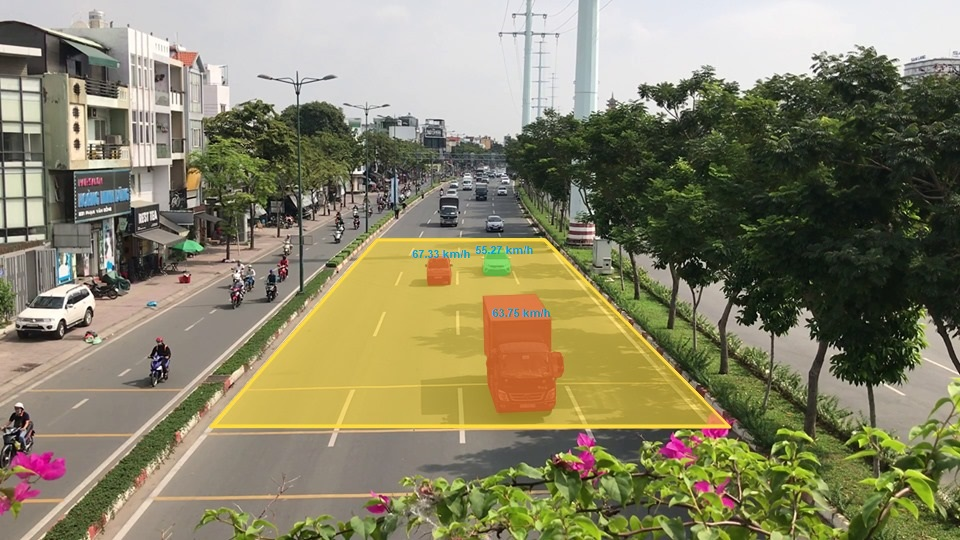
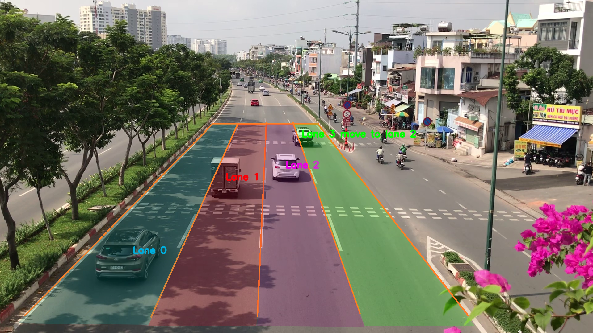
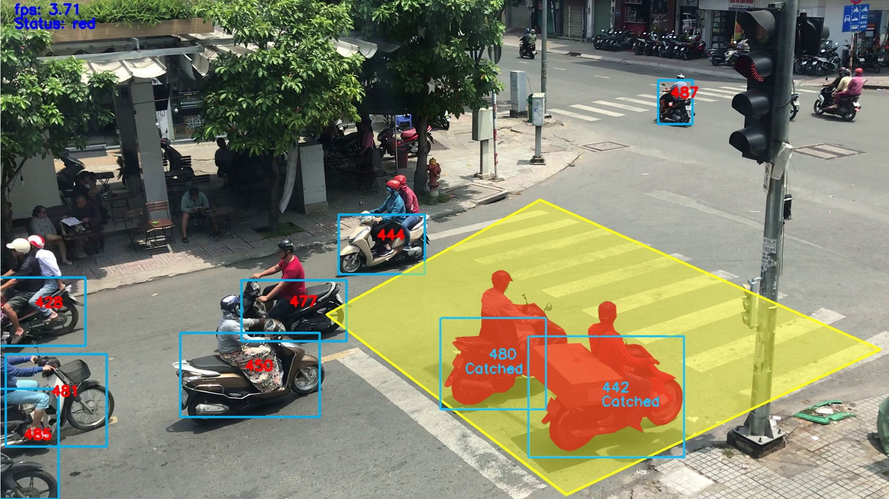
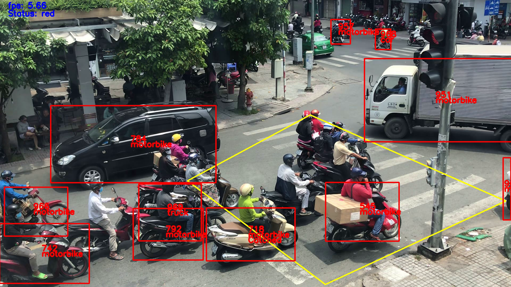

# Traffic monitoring system by computer vision and machine learning
The system is in a jupyter notebook in "source code" directory. For details, please take a look on [our paper](paper.pdf).

It is divide into two modes, and need a lot of pre-processing steps for different positions of a camera. 

Our system can solve three problems:
+ Overspeed
+ Wrong lane departure
+ Cross the red line

We combined "overspeed" and "wrong lane deparute" features into "speed" mode to estimate speed and find lanes on highway. Another mode is "crossRedLine", this mode will detect the violated vehicles at intersections.

We success in catching the violation situations

<figcaption>Fig 1. Assumming the speed limited is 60km/h, there were two detected violated vehicles </figcaption>

<figcaption>Fig 2. The system know that a car in green lane is moving in purple lane</figcaption>

<figcaption>Fig 3. While the traffic light was red, there were two vehicle crossing over the white line</figcaption>

However, there are a lots of problem we need to solve. For example, we often lose vehicle ID when it was overlapping with others. 

<figcaption>Fig 4. Result from "crossRedLine" mode</figcaption>

In Fig 4, in yellow area, there are 7 violated vehicles. However, system can only detect 2 vehicles.

This system can take the input from local video or stream link. We use Twitch server for streaming. While processing with stream video, we realized that the foreign vehicles returned the better results than Vietnamese vehicles for YOLOv3 and SORT.  

We will try to optimize our system tracking result by using ***Deep Sort*** and pre-train YOLO with Vietnamese data in the future.
